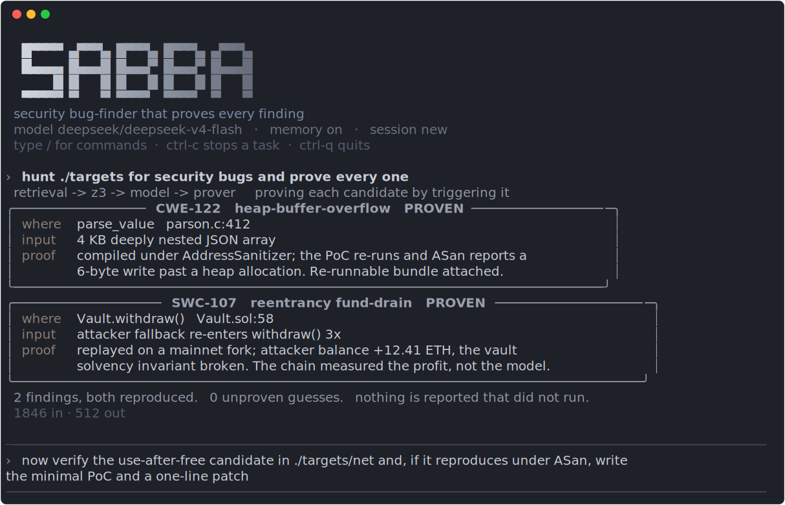

<p align="center">
  
</p>

<h1 align="center">SABBA</h1>

<p align="center">
  <b>Security Templates CLI &amp; MCP Server for coding agents</b> that <b>prove every finding by running it</b>.<br>
  Claude Code, Codex, OpenCode, Cursor, and Hermes call Sabba to prove a change, find and prove
  bugs, vet a skill, and drive the security toolchain &mdash; authorized-scope-only.<br>
  If it does not run, Sabba does not report it.
</p>

<p align="center">
  
  
  
  
</p>

---

Most tools that use a language model ask it "is this function vulnerable?" That is close to
a coin flip, even for large models, and unverified guesses bury maintainers in false
positives. Sabba takes the opposite stance: a model proposes candidates, but an **execution
oracle runs an exploit** and decides whether a security property actually broke. Nothing is
reported unless the exploit reproduces. A finding is not a score, it is a re-runnable proof.

## Use it from any coding agent (MCP)

Sabba runs as an MCP server, so Claude Code, Codex, OpenCode, Cursor, and Hermes can call it:

```bash
claude mcp add sabba -- sabba mcp        # after installing; see Install below
```

Fourteen tools, most token-free: **`verify_change`** (prove a change works in any of 16
languages: a new test fails on the base and passes on the head, via the bundled Magga engine)
and **`prove`** (the same differential, run natively for C/C++/EVM), `verify` / `solve` /
`hunt` / `scan` (find and prove bugs), **`security_scan`** (vet a skill by running it under
observation), `rank`, `run_sandboxed`, and **`kali_run`** (drive nmap / nuclei / ffuf / sqlmap
and the rest, scope-enforced and sandboxed). Install the security command templates with
`sabba templates install`. Full catalog and per-client configs in
[docs/AGENT_INTEGRATION.md](docs/AGENT_INTEGRATION.md).

**Correctness and security in one server.** `verify_change` proves the change does what it
claims; `prove` / `hunt` / `scan` prove it added no new bug. The change-verification engine is
[Magga](https://github.com/8NobleTruths/magga), vendored as a submodule under `magga/` and
driven through `npx`, so both halves ship as one tool.

## What SABBA can do

**Find a real bug and hand you the proof, not a hunch.** Every finding ships with the input
that triggers it and a bundle you can re-run yourself. Two real bugs in cJSON were found this
way and written up in [docs/scans](docs/scans): a stack exhaustion (CWE-674) and a heap
over-read in `parse_object` (CWE-125).

**Work across languages and across chains, with one rule.** The oracle started on C and C++
memory safety and generalized into a registry of provers, one per runtime and vulnerability
class. Every prover obeys the same contract: a finding is minted only from a verdict that a
real, security-relevant crash happened *inside the target*.

| Domain | Runtime it proves on | What counts as proven | Examples |
| --- | --- | --- | --- |
| **C / C++** | clang + AddressSanitizer / UBSan | the sanitizer reports a real memory error | heap / stack overflow, use-after-free |
| **Solidity / EVM** | Foundry mainnet fork | attacker ETH profit or a broken solvency invariant, measured on-chain | reentrancy fund-drain |
| **Python** | atheris | a crash raised in the target, not the harness | stack exhaustion, C-extension segfault |
| **Go** | `go test -fuzz` | a recovered runtime panic at a target frame | index / slice out of range, nil deref |
| **Java / JVM** | Jazzer | a target throwable or a bug-detector finding | stack overflow, injection detectors |
| **Node JS / TS** | Jazzer.js | a target crash or a bug-detector finding | prototype pollution, ReDoS, path traversal |

**Refuse to be fooled, even by a hostile harness.** When a model writes the fuzz harness, a
hostile target could try to steer it into faking a crash. Sabba's fuzzing provers are
*harness-untrusted*: the fuzzer only discovers a candidate input, then a Sabba-owned
reproducer re-runs it and reads the verdict from channels the harness cannot forge (a real
exception's structured stack, or the parent's own measurement of a killed child). It reads
no stdout, no artifact file, no magic phrase. The full model is in
[docs/PROVER_SOUNDNESS.md](docs/PROVER_SOUNDNESS.md).

**Prefer soundness over coverage, and say so.** Where a crash cannot be soundly pinned to the
target (a hang or an out-of-memory that could just as easily be the harness spinning or
pre-filling the heap), Sabba surfaces it as an unverified candidate for a human, but never
mints it as a finding. It would rather miss a bug than report one that did not happen.

**Meet you where you work.** One command, several surfaces: a scriptable CLI (`verify`,
`solve`, `hunt`) and an interactive REPL (pictured above) that streams the model, runs tools,
and renders each proof as a card. Running `sabba` with no arguments opens the REPL.

## Use it from your own agent (MCP)

Sabba runs as a Model Context Protocol server, so Claude Code, Codex, OpenCode, OpenClaw, or
any tool-calling model can spawn it and command it. The agent hands Sabba a target, Sabba runs
the oracle or a prover, and hands back a verdict, so the calling agent gets a proof, not a
guess.

```bash
sabba mcp          # stdio (default); or `sabba mcp --http`
claude mcp add sabba -- sabba mcp     # e.g. register it with Claude Code
```

Tools: `verify`, `solve`, `hunt`, `scan`, `doctor`, `list_provers`. `verify`, `solve`, and
`doctor` need no model, so an agent can prove a suspected bug with no extra credentials. See
[docs/AGENT_INTEGRATION.md](docs/AGENT_INTEGRATION.md) for per-client setup and running the
reasoning on a local model.

## Run it locally, and let it learn where to look

The oracle and provers never needed a model, and the model-driven parts can run on your own
machine too. Point the reasoning at a local, OpenAI-compatible endpoint with
`SABBA_LLM_BACKEND=local`, and train a small CPU risk ranker so retrieval looks at the risky
functions first:

```bash
sabba mltrain          # trains a risk ranker (TF-IDF + logistic), saved to ~/.sabba
```

A three-tier cascade keeps work cheap: Reflex (no model: the ranker, Z3, the oracle), Resident
(the local model), and Teacher (a frontier model) only for the hard cases. The verdict rule
holds across tiers, so a cheaper tier costs coverage, never soundness. See
[docs/LOCAL_ML.md](docs/LOCAL_ML.md).

## Why it is different

```
                 model / z3 / retrieval  ->  candidate input
                                                   |
                                                   v
                     +---------------------------------------+
                     |   execution oracle  /  prover         |
                     |   compile, run the exploit, measure   |
                     +---------------------------------------+
                                    |            |
                              reproduces     does not
                                    |            |
                                  FINDING     dropped
```

The oracle is the one gate. Whether a candidate came from the Z3 synthesizer or from the
model, it is compiled and run before anything is reported. Z3 proposes an input, the oracle
decides. The model proposes an input, the oracle decides. The same discipline carries to
every domain in the table above: on an EVM fork the *chain* measures the attacker's profit,
not the model, so the model cannot grade its own work.

## Install

```bash
git clone --recurse-submodules https://github.com/8NobleTruths/sabba.git
cd sabba
./install.sh
```

That sets up an isolated environment under `~/.sabba` and puts a `sabba` command on your
PATH. Run `sabba doctor` to check the toolchain. Update later with `sabba update`, remove
with `sabba uninstall`.

Provers use the toolchain of the domain you target: clang with AddressSanitizer for C and
C++, Foundry for EVM, and atheris, `go`, Jazzer, or Jazzer.js for the managed languages.
`sabba doctor` reports what is present.

## Quick start

```bash
sabba                                     # opens the REPL; type /setup for guided first-run setup

# no model needed, prove a known target:
sabba verify targets/cwe121_stack_overflow
sabba solve  targets/cwe121_stack_overflow
```

First run opens a guided setup: `/setup` shows a checklist, and each step explains why it is
worth doing, what happens if you skip it, and what happens when you do it. `/local-llm-config`
detects your CPU and RAM, recommends a Qwen2.5-Coder size, and pulls it with Ollama so the
model runs on your machine; `/add-model-key` uses a cloud model instead; `/ml-config` trains
the risk ranker. You can select any command from the `/` menu. `/solve` and `/verify` prove
bugs with no model at all, so they work before any setup.

Bring in a model through OpenRouter (or any OpenAI-compatible endpoint) to hunt fresh code:

```bash
export SABBA_LLM_BACKEND=openrouter
export OPENROUTER_API_KEY=...             # from openrouter.ai/keys
sabba hunt targets/cwe122_heap_overflow --model qwen/qwen-2.5-coder-32b-instruct
```

Keys are read from the environment, never stored in the repo, and a pre-commit hook blocks
anything that looks like a credential (see [CONTRIBUTING.md](CONTRIBUTING.md)).

## How it works, in more depth

- [docs/SABBA_AGENT_DESIGN.md](docs/SABBA_AGENT_DESIGN.md) - the C and C++ bug-finder: the
  oracle, retrieval, the Z3 synthesizer, and the reasoning agent.
- [docs/PROVERS_MULTI_DOMAIN_DESIGN.md](docs/PROVERS_MULTI_DOMAIN_DESIGN.md) - how the oracle
  generalizes into the prover registry, including Web3 and Solidity.
- [docs/PROVER_SOUNDNESS.md](docs/PROVER_SOUNDNESS.md) - the harness-untrusted verification
  model that makes the fuzzing provers sound against an adversarial harness.
- [docs/WATER_LAYER_DESIGN.md](docs/WATER_LAYER_DESIGN.md) - the next layer: an agent that
  keeps its skills as runnable code, runs without a frontier model, and can be rebuilt from a
  seed. Provers are the skills it accumulates.

## Status

The native oracle, retrieval, Z3 synthesis, the reasoning agent, and the full prover registry
across C/C++, Solidity/EVM, Python, Go, Java, and Node run today, each with live proofs. The
Water Layer and a broader symbolic-execution pass are next.

## License

Apache-2.0. See [LICENSE](LICENSE). The framework is open source. Trained model weights and
datasets are developed separately and are not part of this repository.
